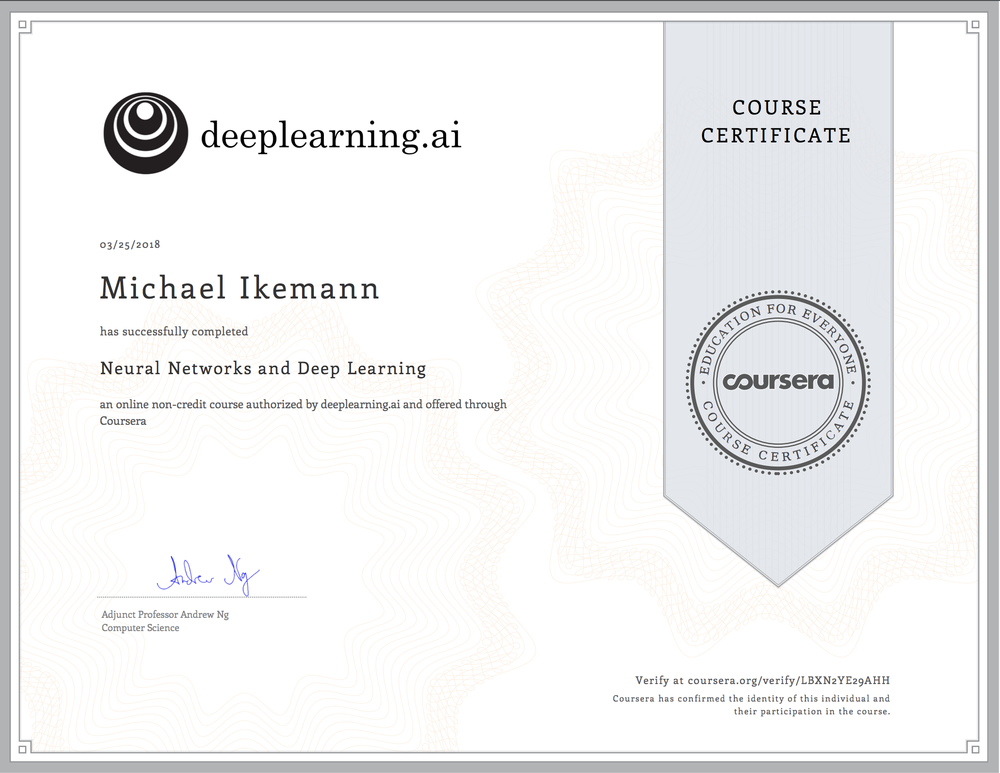

# Deep Learning.ai

In this repository you can find my project results of the 5 month specialization course **DeepLearning.ai** provided by the Stanford professor for artificial intelligence Andrew Ng.

For more details see [https://www.deeplearning.ai](https://www.deeplearning.ai)

## Course 1 / 5 - Neural Networks and Deep Learning

## Course 2 / 5 - Improving Deep Neural Networks
*In progress*

## Course 3 / 5	- Structured Machine Learning Projects

## Course 4 / 5 - Convolutional Neural Networks

## Course 5 / 5 - Sequence Models